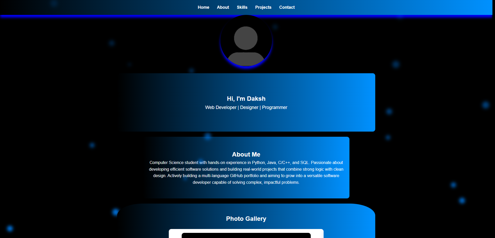
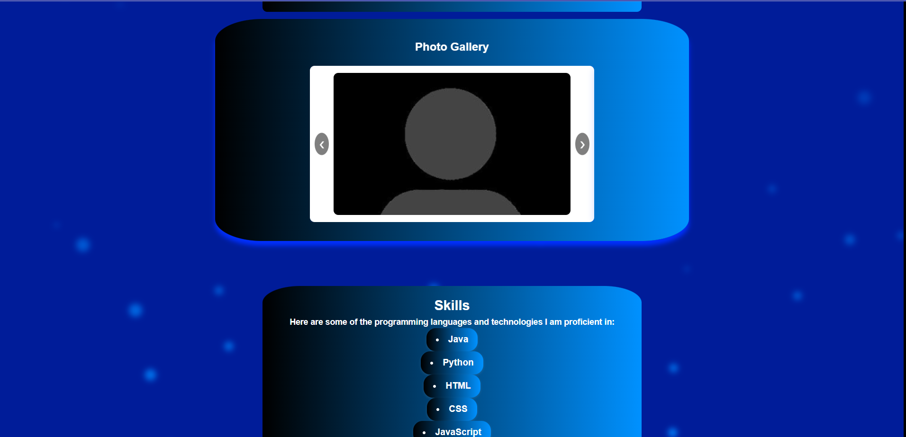
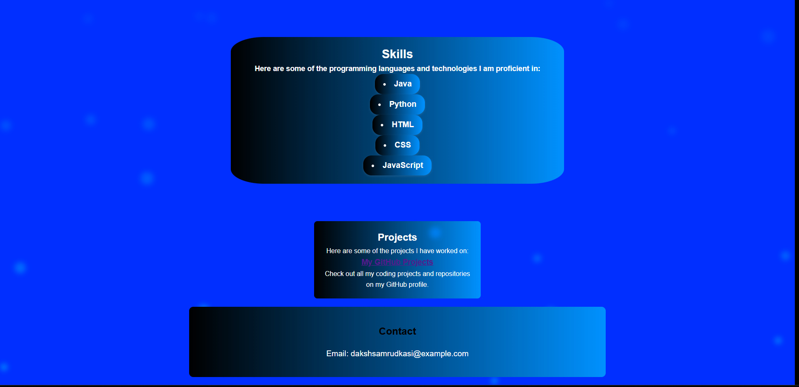

# Personal Portfolio

A personal portfolio website built using **HTML**, **CSS**, and **JavaScript** to showcase my skills, projects, and contact information.

## # Home Page

>  Clean, dark-themed section with animated particles and glowing effects. Includes navigation bar and profile picture.

---

## # Skills & About Section

>  Shows core technical skills with gradient backgrounds. About section highlights professional summary and experience.

---

## # Projects & Contact Section

>  Project cards with hover effects. Contact section with clickable links to email, LinkedIn, and GitHub.

---

## # Features
- Responsive navigation bar
- Smooth scrolling between sections
- Skills section with badges
- Projects section with GitHub links
- Contact section with email
- Image carousel for profile pictures

## # Project Structure
personal-portfolio/
<br>
│── index.html # Main HTML file
<br>
│── css/
<br>
│ └── style.css # Stylesheet
<br>
│── js/
<br>
│ └── script.js # JavaScript functionality
<br>
│── assets/ # Images & icons
<br>
└── README.md # Project documentation
<br>

## # How to Use
1. Clone the repository:
   ```bash
   git clone https://github.com/Daksh-dev-01/personal-portfolio.git

